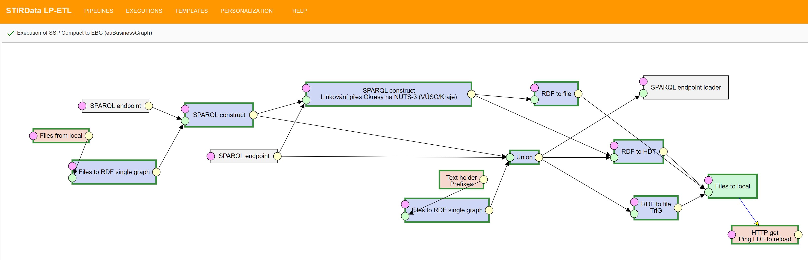

# Czech Business Registry transformations
This repository contains [LinkedPipes ETL] transformation pipelines used to transform the [Czech Business Registry] from its XML representation.
1. First, a proper representation in RDF according to the [Semantic Government Vocabulary] is created.
2. Second, the Semantic Government Vocabulary representation is transformed to the European Business Graph vocabulary representation used in the [STIRData] project.

## Source data
The source data is available in the [Czech National Open Data Portal]. [The datasets](https://data.gov.cz/datové-sady?poskytovatel=https%3A%2F%2Frpp-opendata.egon.gov.cz%2Fodrpp%2Fzdroj%2Forgán-veřejné-moci%2F00007064&klíčová-slova=Úplný&klíčová-slova=2021) are split by year - historical per-year snapshots + actual year, region (actually regional court managing that part of the registry) and full/valid records, where in the valid records, some of the deprecated information about no longer existing companies is missing.

Each dataset has 4 distributions: XML, CSV (ugly with embedded JSON values), Zipped XML and Zipped CSV.
We use the XML representation for further transformation.

## Transformation from source to Semantic Government Vocabulary version

1. [The pipeline](assets/pipelines/sgov.jsonld) accesses the https://data.gov.cz/sparql SPARQL endpoint of the [Czech National Open Data Portal] and searches for the datasets of the business registry - all regions, year 2021, full version, specifically their XML version
2. The files are converted to initial RDF using XSLT transformations
3. The RDF is further refined based on different aspects of the company records. The blue parts are common for all company types. The yellow-green parts are specific to joint-stock companies, the pink parts are specific to the limited liability companies. The green parts on top generate codelists from the data.
4. The full ontological representation is then compacted to form a LOD-style RDF version of the data. This is the version to be published by the Business registry, if we succeed in convincing them. Therefore, this is the source of the transformation to the STIRData EBG-based model.
5. Initially, we loaded the data into Apache Jena Fuseki instance via HTTP, which proved not to be viable for the whole dataset of 700 000 companies. Instead, we create an RDF dump.
6. The RDF dump is then loaded into Apache Jena Fuseki instance via the `tdb2.tdbloader` Apache Jena tool.
7. The whole process takes approx. 11 hours to complete.

## Transformation from Semantic Government Vocabulary version to STIRData model

[This pipeline](assets/pipelines/ebg.jsonld) pipeline converts the result of the previous one to the [STIRData EBG-based model](https://stirdata.github.io/data-specification/), so far using a single SPARQL query.
Then, the mapping to NUTS codes via a Czech cadastre dataset is done using Federated SPARQL query to the Charles University RDF version of the Czech cadastre, resulting in a mapping in [RDF TriG](https://obchodní-rejstřík.stirdata.opendata.cz/soubor/or-ebg-nuts.trig).
Finally, the results of the transformation are dumped to [RDF TriG](https://obchodní-rejstřík.stirdata.opendata.cz/soubor/or-ebg.trig) and loaded to Apache Jena Fuseki instance using `tdb2.tdbloader`.
Also, an [HDT dump](https://obchodní-rejstřík.stirdata.opendata.cz/soubor/or.trig) is created and the Linked Data Fragments server gets pinged to reload the HDT file.
The whole process takes approx. 3 hours to complete.

## Presentation
The dataset is registered in the [STIRData data catalog](https://stirdata.opendata.cz/datasets), and presented as [RDF TriG dump](https://obchodní-rejstřík.stirdata.opendata.cz/soubor/or.trig), [HDT dump](https://obchodní-rejstřík.stirdata.opendata.cz/soubor/or.trig), [SPARQL endpoint](https://obchodní-rejstřík.stirdata.opendata.cz/sparql) and [Linked Data Fragments endpoint](https://obchodní-rejstřík.stirdata.opendata.cz/ldf/).

[LinkedPipes ETL]: https://etl.linkedpipes.com "LinkedPipes ETL"
[Semantic Government Vocabulary]: https://doi.org/10.1016/j.websem.2018.12.009 "Semantic Government Vocabulary"
[STIRData]: https://stirdata.eu "STIRData"
[Czech National Open Data Portal]: https://data.gov.cz/en "Czech National Open Data Portal"